## Prerequisites
 - **Tutorials:** 'Information View Conversion' and 'Create Tables and Import Data'

## Details
### You will learn
  - How to create a union between both in-memory and extended Tables
  - How to create a Calculation View

### Time to Complete
 **15 Min**

 ---
[ACCORDION-BEGIN [Step 1: ](Creating a Calculation View from the Union of In-Memory and Extended Tables)]

 We will be creating a calculation view called `CA_UNION`, which will be a union between `ORDERS_CS` and `ORDERS_DT`. If these tables have not been set up, follow the instructions in the Prerequisites.

To start off, right click `tutorial_All_Calc` package and click **New** > **Calculation View**

In the subsequent screen, fill out the values for your calculation view. Name it `CA_UNION`, and make sure it's type is `Graphical`, and has a data category of `Cube`. Do not check the "With Star Join" box. Click **Finish** to continue.

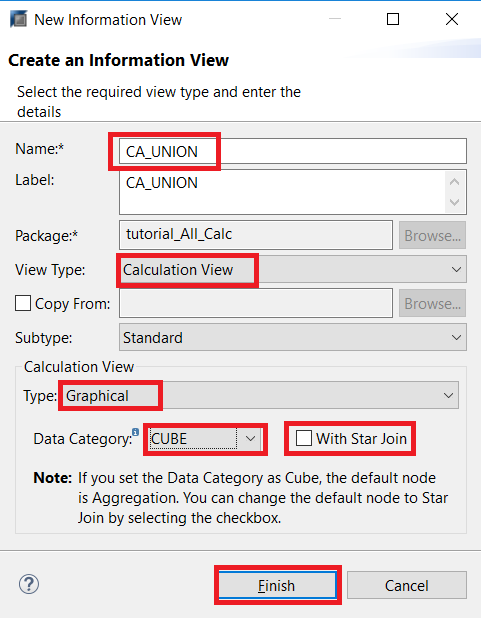

You should now see the graphical editor for your new calculation view. To start building our calculation view, drag one union node and two projection nodes onto the screen. Rename one of the projection nodes to "`Hot_data`" and the other to "`Warm_data`".

> Note: To rename a node, click on their **title**.

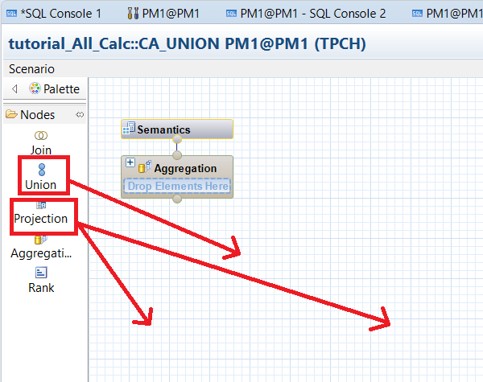

After renaming, your diagram should look like this:

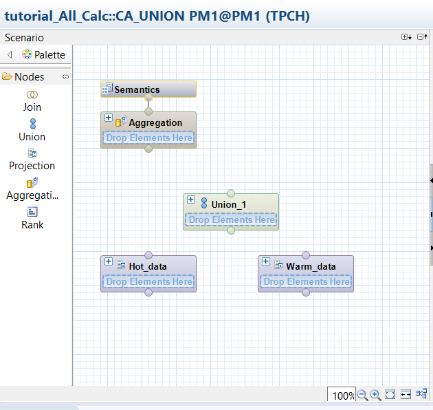

We will now add the `ORDERS_CS` table as an element in `Hot_data` and the `ORDERS_DT` table as an element in `Warm_data`. To do this, navigate to where your `ORDERS_CS` and `ORDERS_DT` tables are in the left Systems panel, and drag/drop them into `Hot_data` and `Warm_data`, respectively.

> Note: If you have followed the tutorials, the tables should be in `<SID> (TPCH)` > Catalog > TPCH > Tables.

Select the `Warm_data` node, and you will see the details show up under the "**Details**" panel on the right hand side. Right click the top of the diagram and click "**Add All to Output**".

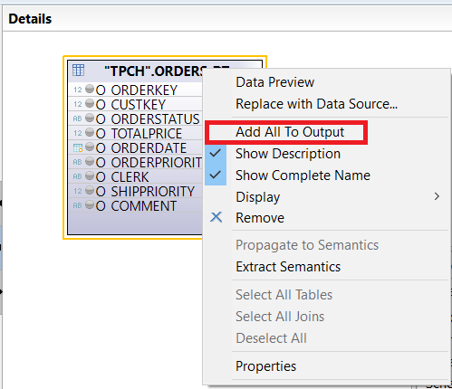

After doing this, all the gray circles will become orange. This means those columns will be sent to the next node.

Repeat this process with the `Hot_data` node.

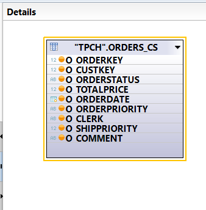

Now, connect the `Hot_data` node and the `Warm_data` node to `Union_1`. To do this, press your cursor over the gray dot on the top of one node, and drag it over to the gray dot of another node.

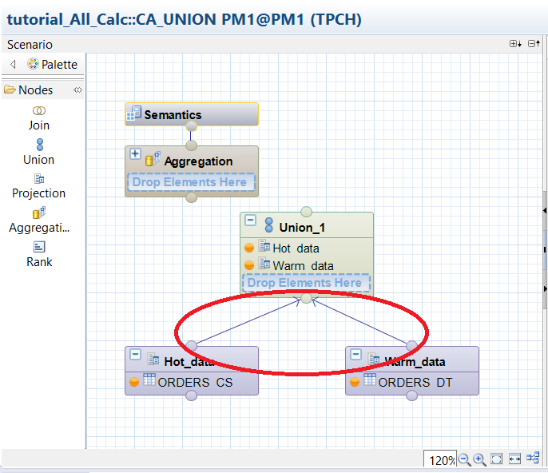

Select `Union_1` to see its details under the "**Details**" panel. You will see 2 sections - one called **Source**, and another called **Target**. We will need to create source and target mappings for the tables we are creating a union for. Under source, expand `Warm_data`. Select all columns (hold down `ctrl`), left click, and choose **Add to Target**.

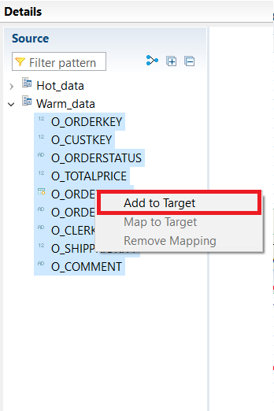

This will add these columns to the target section, along with mapping lines. Next, we will be mapping the columns in `Hot_data` as well. This can either be done manually, or be using the "**Auto Map By Name**" button, since both tables share the same columns. We will be doing the latter way.

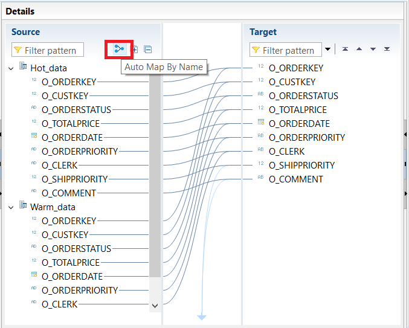

Back in the **Scenario** panel, join `Union_1` and `Aggregation` together by clicking on the gray dot at the top of the `Union_1` node and dragging it over to the gray dot at the bottom of the `Aggregation` node.

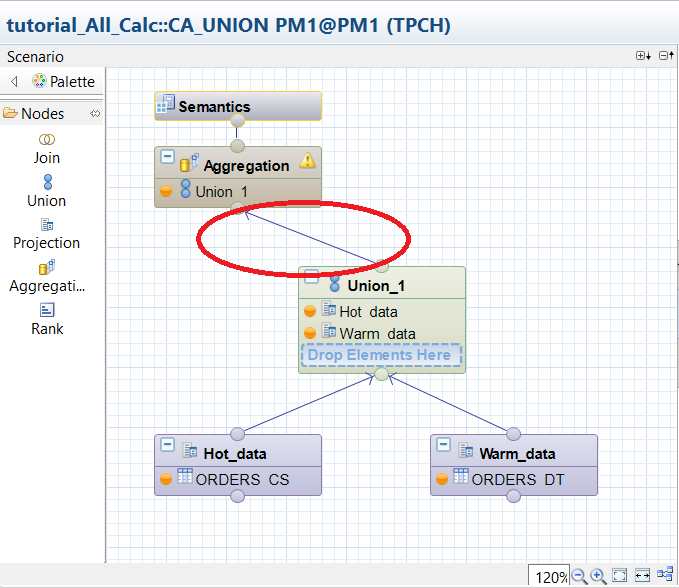

Now, select `Aggregation` to edit it in the Details panel.

In the Details panel, you will see the columns which have been passed from `Union_1`. For every column except `O_TOTAL_PRICE`, right click and select "Add to Output".

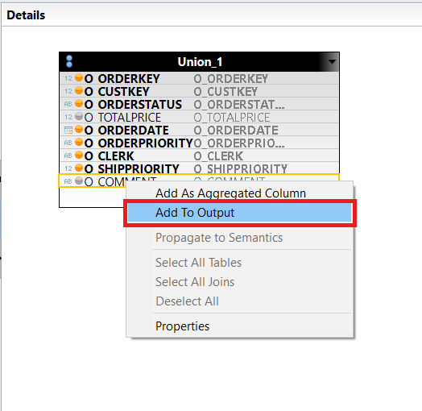

These columns will now be outputted as attribute types. For `O_TOTALPRICE`, right click and select "**Add as Aggregated Column**" instead. This will set it as an output column of type measure.

This is important, because all calculation views of type Cube require *at least* one measure.

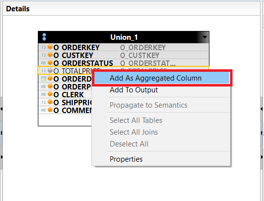

Finally, select **Semantics** from the **Scenario** panel, and view the details in the **Details** panel. Ensure that the Aggregation for `O_TOTALPRICE` is set to **Max**, and toggle the **Type** so that all columns other than `O_TOTALPRICE` are of type attribute of a blue diamond.

The aggregation defines how `O_TOTALPRICE` will be joined. Since there shouldn't be any duplicate rows between `ORDERS_CS` and `ORDERS_DT`, it does not really matter.

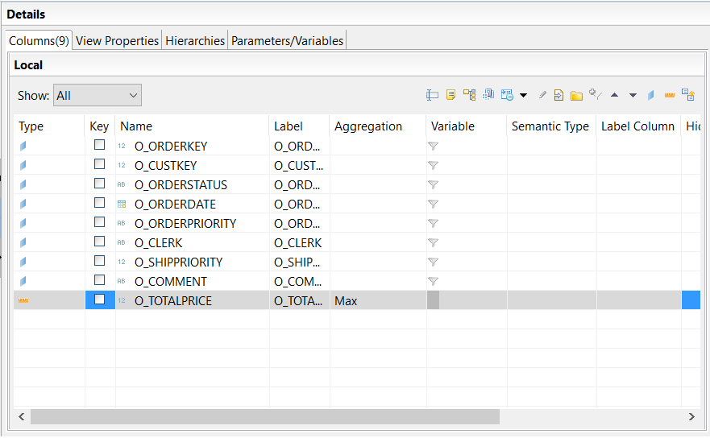

We have now completed our calculation view, which created a union between both in-memory and extended tables.

[ACCORDION-END]

[ACCORDION-BEGIN [Step 2: ](Activate View)]
Navigate to `tutorial_All_Calc` in **Systems**. Under `tutorial_All_Calc` > Calculation Views, right click `CA_UNION` and click **Activate**.

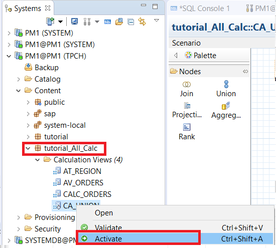

[DONE]

[ACCORDION-END]
